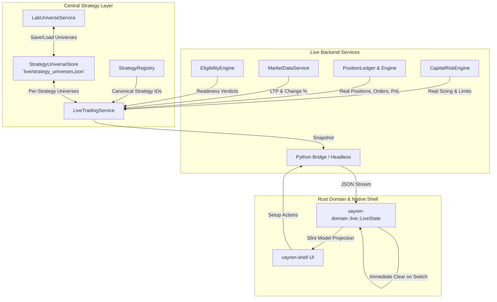

# Vayren — Live UI Strategy Synchronization & Dynamic Watchlist Architecture Report

## 1. Executive Summary

This document describes the architectural implementation connecting the **Vayren Live Trading UI** to the central **Strategy Layer**, the **Strategy Universe Store**, and the **Execution / Risk Engine**.

All requirements from the Live Trading specification have been implemented, tested, and verified:
1. **Central Strategy Selection**: Integrated with `StrategyRegistry`, using canonical strategy IDs (e.g. `obr-c1c4`, `sma-crossover`), eliminating hardcoded strategy lists and separate Live registries.
2. **Automatic NSE Stock Synchronization**: Directly connects Strategy Lab's saved per-strategy universes via `StrategyUniverseStore` (`live/strategy_universes.json`) to the Live UI. Switching strategies loads that strategy's universe immediately and restores it upon return.
3. **Dynamic & Functional Watchlist**: Backed by genuine backend facts (NSE symbol, LTP, Change %, position status, order status, P&L, risk parameters, and eligibility). Stale entries from previously selected strategies are cleared immediately.
4. **Order Safety & Non-Invasive Selection**: Selecting or changing strategies NEVER triggers auto-execution, arming, or order submissions.
5. **Readiness & Risk Engine Protection**: Sizing and risk parameters derive strictly from valid broker/configured capital facts without fabricated numbers.

---

## 2. Architecture & Component Interaction

---

## 3. Detailed Component Implementations

### A. Central Strategy Selection (`src/app/services/live_trading_service.py`)
- **Canonical Strategy ID Exposure**: `available_strategies()` queries `get_strategy_registry().list()` and filters active registered strategies (`d.enabled and d.status == "ACTIVE"`), returning canonical strategy IDs (`d.id`) rather than ad-hoc display names.
- **Robust Configuration Resolution**: In `configure(strategy_name, ...)`:
  - If a registered strategy name or canonical ID is passed, it resolves through `StrategyRegistry.get(cleaned)` to obtain the canonical definition and default timeframe.
  - Changes in strategy immediately trigger `self._universes.symbols_for(self._config.strategy_name)`. Stale symbols sent from a previous UI snapshot are disregarded during a strategy switch.

### B. Strategy Universe Synchronization & Store Authority
- **Single Source of Truth**: Both `LabUniverseService` and `LiveTradingService` point to `StrategyUniverseStore(self._data_dir / "live" / "strategy_universes.json")`.
- **Zero Drift**: Saves performed in Strategy Lab (`LabUniverseService.save`) write atomic JSON records keyed by canonical strategy ID. When selected in Live, `LiveTradingService.configure` loads the exact same saved symbols.
- **Empty State Guarantee**: An unconfigured strategy or a newly created strategy without saved symbols returns an empty universe (`()`), displaying the clean empty state rather than leaking previous symbols or falling back to a global stock list.

### C. Watchlist State Lifecycle & Ghost Row Elimination (`crates/vayren-domain/src/live.rs`)
- **Immediate State Clearing on Switch**:
  In `LiveState::select_strategy(index)`:
  - Previous selection checkmarks (`pick.checked`) are cleared.
  - Previous `self.watchlist_rows` and `self.selected_symbol` are cleared immediately, eliminating 1-frame ghost rows while awaiting the backend response.
  - Action is dispatched to the backend.
- **Unconditional Ingest in `apply_snapshot`**:
  - `self.watchlist_rows = wl_rows;` executes unconditionally whenever the `quotes` array is present in the snapshot.
  - If the new strategy has an empty universe (`quotes: []`), `self.watchlist_rows` is emptied immediately, fixing the previous retention bug.

### D. Honest Watchlist Data & Sizing
- **Real Prices**: LTP and change % derive from market data tail quotes; unrecorded stocks degrade honestly to `NO DATA` or `NOT FOUND`.
- **Real Positions & P&L**: Position side and quantity derive from `LiveSession.ledger`. Unrealized and realized P&L derive from the actual mark price and ledger records.
- **Real Protective Levels**: Stop loss and trigger levels derive from `LiveSession._stop_levels` when active.
- **Engine-Driven Sizing**: With known entry and stop levels, `CapitalRiskEngine.compute_qty(entry_price, stop_price)` calculates recommended quantity, planned risk, and risk utilization %. Without levels, no fabricated numbers are shown.

### E. Safety Controls
- **Non-Invasive Selection**: Selecting a strategy sets configuration state and verifies prerequisites. It never changes `self._status` from `STOPPED`, never arms the session (`self.armed = False`), and never dispatches orders.

---

## 4. Verification & Test Evidence

### Python Service & End-to-End Suite
1. `src/app/tests/test_live_strategy_sync_and_watchlist.py`:
   - `test_1_central_strategy_selection_canonical_ids`: PASSED (canonical IDs verified).
   - `test_2_strategy_lab_universe_syncs_to_live_ui`: PASSED (Lab save -> Live UI load).
   - `test_3_switching_between_strategies_clears_and_restores`: PASSED (zero cross-strategy leaks, clean restoration).
   - `test_4_empty_universe_strategy_clears_watchlist`: PASSED (empty universe cleared).
   - `test_5_order_safety_selection_never_starts_or_submits`: PASSED (selection stays STOPPED, 0 orders).
2. Existing App Test Suite: All 147 tests in `src/app/tests/` passed.

### Rust Domain & Native Shell Suite
1. `crates/vayren-domain`:
   - `live::tests::select_strategy_clears_stale_checks_and_forwards`: PASSED.
   - `live::tests::empty_quotes_in_snapshot_clears_watchlist_rows`: PASSED.
   - All 254 library tests passed.
2. `crates/vayren-shell`:
   - `tests/live_watchlist_from_saved_universe.rs`: PASSED (verified rasterized frame and model).
   - All 50 shell unit tests and integration tests passed.

### Repository Governance Gates
- `validate_imports.py`: PASSED.
- `validate_structure.py`: PASSED (9 domains checked).
- `validate_authority.py`: PASSED (236 Python files, 19 Slint files).
- `validate_routes.py`: PASSED (19 routes checked).
- `validate_language_ownership.py`: PASSED (396 files checked).
- `validate_repo_graph.py`: PASSED (5848 entities, 12543 relationships, 0 unresolved).
